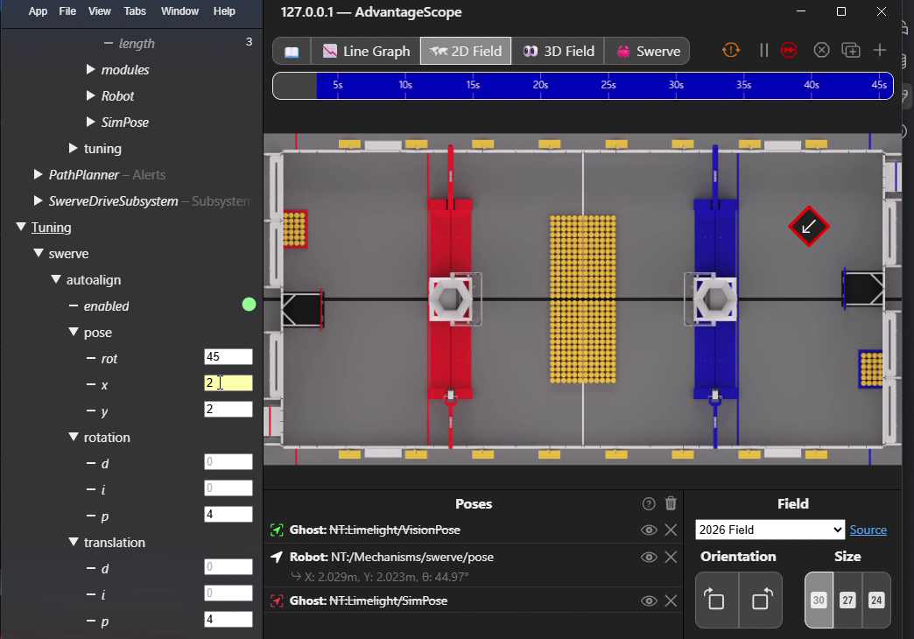
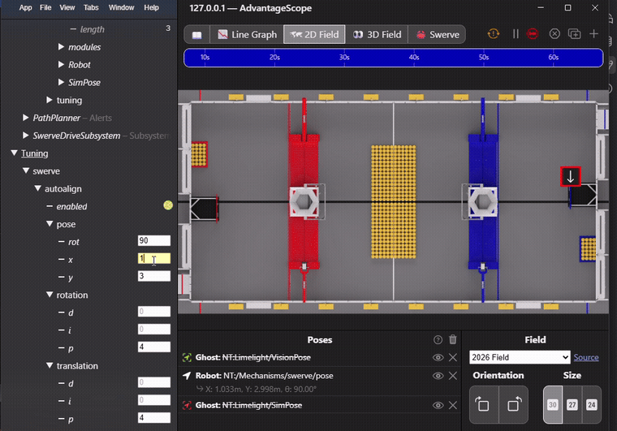
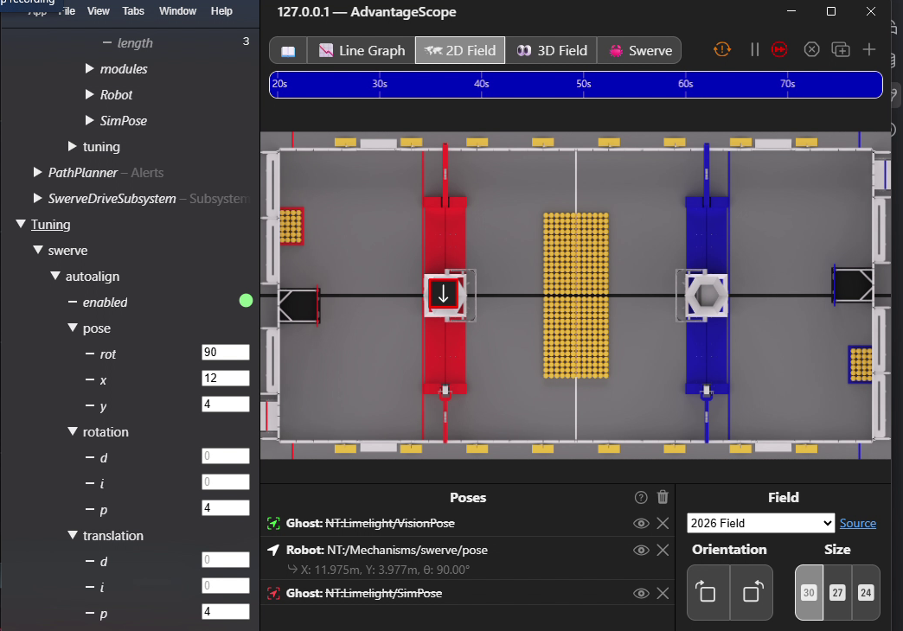

# Swerve Drive

## Why `SwerveDrive` is different from other mechanisms

Every other mechanism in YAMS (`Arm`, `Elevator`, `Pivot`, `FlyWheel`) wraps a single `SmartMotorController`. `SwerveDrive` is a mechanism made of mechanisms: it owns an array of `SwerveModule`s, and each `SwerveModule` owns two `SmartMotorController`s of its own (drive and azimuth). `SwerveDriveConfig` is where the two levels meet: you build each `SwerveModule` (and its own `SwerveModuleConfig`) first, then hand the finished modules to `SwerveDriveConfig`, which derives the robot's kinematics automatically from where you told each module it physically sits.

## Basic Swerve Config

Given the [tutorial](../tutorials/swerve-drive.md), here is the shape of a four-module config. Modules are ordered clockwise from front-left: FL, FR, BL, BR.

```java
SmartMotorControllerConfig driveCfg = new SmartMotorControllerConfig(this)
      .withWheelDiameter(Inches.of(4))
      .withGearing(new MechanismGearing(6.75))
      .withClosedLoopController(0.3, 0, 0)
      .withFeedforward(new SimpleMotorFeedforward(0, 1.9, 0.01))
      .withStatorCurrentLimit(Amps.of(40))
      .withTelemetry("driveMotor", TelemetryVerbosity.HIGH);

SmartMotorControllerConfig azimuthCfg = new SmartMotorControllerConfig(this)
      .withGearing(new MechanismGearing(12.8))
      .withClosedLoopController(1.0, 0, 0)
      .withFeedforward(new SimpleMotorFeedforward(0, 1))
      .withStatorCurrentLimit(Amps.of(20))
      .withTelemetry("angleMotor", TelemetryVerbosity.HIGH);

SmartMotorController driveSMC   = new SparkWrapper(driveMotor,   DCMotor.getNEO(1), driveCfg);
SmartMotorController azimuthSMC = new SparkWrapper(azimuthMotor, DCMotor.getNEO(1), azimuthCfg);

SwerveModuleConfig moduleConfig = new SwerveModuleConfig(driveSMC, azimuthSMC)
      .withAbsoluteEncoder(encoder.getAbsolutePosition().asSupplier())
      .withLocation(Meters.of(0.3), Meters.of(0.3)) // front, left, from robot center
      .withOptimization(true)
      .withTelemetry("frontleft", TelemetryVerbosity.HIGH);

SwerveModule fl = new SwerveModule(moduleConfig);
// ...repeat for fr, bl, br with their own locations...

SwerveDriveConfig config = new SwerveDriveConfig(this, fl, fr, bl, br)
      .withGyro(gyro.getYaw().asSupplier())
      .withMaximumChassisSpeed(MetersPerSecond.of(4.5), DegreesPerSecond.of(360))
      .withTranslationController(new PIDController(1.0, 0, 0))
      .withRotationController(new PIDController(1.0, 0, 0))
      .withStartingPose(new Pose2d());

SwerveDrive drive = new SwerveDrive(config);
```

## Module Location Drives the Kinematics

`SwerveModuleConfig.withLocation(front, left)` (or `withDistanceFromCenterOfRotation`) is not just bookkeeping. `SwerveDrive` builds its `SwerveDriveKinematics` directly from the locations of every module you pass it, so the drive/rotate math is always correct for your specific chassis dimensions without you ever constructing a `SwerveDriveKinematics` yourself.

```java
SwerveModuleConfig moduleConfig = new SwerveModuleConfig(driveSMC, azimuthSMC)
      .withLocation(Meters.of(0.3), Meters.of(0.3)); // X = forward, Y = left, from robot center
```

`withDistanceFromCenterOfRotation` is an equivalent alternate form:

```java
moduleConfig.withDistanceFromCenterOfRotation(Meters.of(0.3), Meters.of(0.3));
```


Every module needs its location set before it's handed to `SwerveDriveConfig`. A missing or wrong location silently produces incorrect kinematics rather than a compile error, so double check trackwidth/wheelbase math when a robot doesn't drive straight.


The `withOptimization(true)` seen in the config above is a per-module flag, not a drive-level one. See [Optimization and Cosine Compensation](swerve-module.md#optimization-and-cosine-compensation) on the Swerve Module page for what it (and its counterpart `withCosineCompensation`) actually does.

## Gyro Integration and Field vs. Robot Relative Speeds

`SwerveDriveConfig.withGyro(Supplier<Angle>)` is what lets `SwerveDrive` convert between field-relative and robot-relative `ChassisSpeeds`. Internally, `SwerveDrive` always drives the modules with robot-relative speeds; `setFieldRelativeChassisSpeeds` just rotates the requested speeds into the robot frame using the current gyro angle before handing them to the same code path robot-relative callers use.

```java
drive.setFieldRelativeChassisSpeeds(new ChassisSpeeds(1.0, 0, 0));
```

`SwerveDriveConfig.withGyroOffset` and `withGyroInverted` exist so the gyro's raw zero and sign can be corrected without touching your drive code:

```java
config.withGyroOffset(Degrees.of(90))
      .withGyroInverted(true);
```

`withGyroVelocity`/`withGyroAngularVelocityScaleFactor` let you feed the gyro's own angular velocity measurement into pose estimation instead of relying solely on module odometry, which is usually more accurate during fast rotation:

```java
config.withGyroVelocity(() -> DegreesPerSecond.of(gyro.getRate()))
      .withGyroAngularVelocityScaleFactor(1.0);
```


`SwerveInputStream` is the recommended way to turn raw joystick axes into a `ChassisSpeeds` supplier for `drive(...)`; it handles deadbanding, axis cubing, and alliance-relative flipping so you don't have to write that math by hand. See [Swerve Input Stream](swerve-input-stream.md) for the full picture, or the [tutorial](../tutorials/swerve-drive.md) for a worked example.


```java
SwerveInputStream input =
    SwerveInputStream.of(drive, controller::getLeftX, controller::getLeftY)
        .withControllerRotationAxis(controller::getRightX);
setDefaultCommand(drive.drive(input));
```

## Auto-Align: `driveToPoseSetpoint` and Live PID Tuning

`SwerveDrive` includes a built-in field-relative auto-align: `driveToPoseSetpoint(Pose2d targetPose)` uses the translation and rotation `PIDController`s from `SwerveDriveConfig` to compute the `ChassisSpeeds` needed to drive toward a target pose, and `driveToPose(Pose2d)` wraps that into a ready-to-schedule `Command`.

```java
Command alignToScore = drive.driveToPose(new Pose2d(2, 4, Rotation2d.kZero));
alignToScore.schedule();
```

What makes this different from wiring up the PID controllers yourself is the telemetry integration: `SwerveDriveTelemetryConfig` publishes a live-tunable target pose (as separate `autoalign/setpoint/x`, `autoalign/setpoint/y`, `autoalign/setpoint/rot` entries, gated by an `autoalign/enabled` toggle) and the translation/rotation PID gains to NetworkTables, and `SwerveDrive` publishes a matching tuning command to SmartDashboard (`Mechanisms/<name>/tuning/driveToPose`). Running that command from the dashboard reads `autoalign/enabled` every loop; while it's `true`, it also reads the tunable pose fields and PID gains and drives the real (or simulated) robot toward them, so you can tune auto-align PID gains — or drive to an arbitrary pose — live without redeploying code. Changing a gain only resets that controller's integrator if the gain actually changed, so tuning doesn't wipe accumulated state every loop.

### How to Use Live Tuning

1. Make sure the fields you need are enabled. `TranslationP/I/D`, `RotationP/I/D`, `autoalign/setpoint/x`, `autoalign/setpoint/y`, `autoalign/setpoint/rot`, and `autoalign/enabled` are all already live-tunable at `HIGH` verbosity, so no extra opt-in is needed.
2. Deploy the robot code, then open NetworkTables in AdvantageScope, Shuffleboard, Elastic, or a similar dashboard tool and browse to `Tuning/<name>/` (the name you passed to `withTelemetry`). You should see `autoalign/translation/p`, `i`, `d`, `autoalign/rotation/p`, `i`, `d`, `autoalign/setpoint/x`, `autoalign/setpoint/y`, `autoalign/setpoint/rot`, and `autoalign/enabled`. The gain entries start pre-seeded with whatever you passed to `withTranslationController(...)`/`withRotationController(...)`, not `0`, the same way `SmartMotorControllerTelemetry` seeds its `kP`/`kI`/`kD` tuning entries from the motor's configured PID.
3. On SmartDashboard, find the command at `Mechanisms/<name>/tuning/driveToPose` and schedule it, either by binding it to a button or running it directly from your dashboard's command widget. Starting it resets both PID controllers; it then checks `autoalign/enabled` every loop and, while `true`, calls `driveToPoseSetpoint(...)` using whatever `autoalign/setpoint/x`/`autoalign/setpoint/y`/`autoalign/setpoint/rot` and gains currently sit in `Tuning/<name>/`.

<figure><figcaption><p>AdvantageScope 2D field with the <code>driveToPose</code> command scheduled and the <code>Tuning/swerve/autoalign</code> tree expanded, showing <code>enabled</code>, <code>pose/x,y,rot</code>, and the translation/rotation gain entries.</p></figcaption></figure>

4. With the tuning command running, edit `autoalign/translation/p` (and the other gain entries) live from your dashboard. Set `autoalign/setpoint/x`/`autoalign/setpoint/y` (meters) and `autoalign/setpoint/rot` (degrees) to the field-relative pose you want, then flip `autoalign/enabled` to `true`. The robot immediately drives toward the target using the current gains, no redeploy needed.

<figure><figcaption><p>Live tuning in simulation: the robot drives from its current pose to a target of <code>autoalign/setpoint/x=12</code>, <code>autoalign/setpoint/y=4</code>, <code>autoalign/setpoint/rot=90</code> while <code>autoalign/enabled</code> is <code>true</code>.</p></figcaption></figure>

5. Once a gain feels right, copy its value back into the matching `SwerveDriveConfig.withTranslationController(...)` / `withRotationController(...)` call in code. Values edited live in NetworkTables are not persisted and reset the next time the robot code restarts.
6. Flip `autoalign/enabled` back to `false` (or unschedule the tuning command) before handing control back to the driver.

<figure><figcaption><p>Robot settled at the target pose (<code>X: 11.975m, Y: 3.977m, θ: 90.00°</code> against a target of <code>12, 4, 90</code>).</p></figcaption></figure>

## Module Drive/Azimuth Live PID Tuning

`SwerveDriveTelemetryConfig` also exposes a shared set of tunable feedback (PID) gains, feedforward (`kS`/`kV`/`kA`) gains, and a setpoint for every module's drive motor (`modules/drive/feedback/p,i,d`, `modules/drive/feedforward/s,v,a`, `modules/drive/velocity`) and azimuth motor (`modules/azimuth/feedback/p,i,d`, `modules/azimuth/feedforward/s,v,a`, `modules/azimuth/angle`), gated by `modules/drive/enabled` and `modules/azimuth/enabled` toggles respectively. These are **shared across every module** on the drive, not per-module fields — flipping `modules/drive/enabled` to `true` commands the same velocity setpoint (and applies the same gains) to every module's drive motor simultaneously, which is the normal case for tuning a symmetric swerve chassis without repeating the same numbers four times.

`SwerveDrive` reads these fields from the same `Mechanisms/<name>/tuning/driveToPose` command used for auto-align tuning (see above); scheduling that command is what makes both auto-align and module tuning live.

1. `modules/drive/feedback/p,i,d`, `modules/drive/feedforward/s,v,a`, `modules/drive/velocity`, `modules/drive/enabled`, `modules/azimuth/feedback/p,i,d`, `modules/azimuth/feedforward/s,v,a`, `modules/azimuth/angle`, and `modules/azimuth/enabled` are all already live-tunable at `HIGH` verbosity. The gain entries are pre-seeded from the first module's configured drive/azimuth PID and `SimpleMotorFeedforward`, not `0`.
2. Schedule `Mechanisms/<name>/tuning/driveToPose` (the same command as auto-align tuning).
3. Edit `modules/drive/feedback/p`/`i`/`d` and `modules/drive/feedforward/s`/`v`/`a` live; each gain only propagates to every module's drive motor the moment it actually changes, so tuning doesn't spam `SmartMotorController.setKp(...)`/`setKs(...)` every loop. Set `modules/drive/velocity` (meters per second) to the speed you want to test, then flip `modules/drive/enabled` to `true` — every module immediately targets that velocity, holding whatever azimuth angle it was already at, using the current gains.
4. Do the same for `modules/azimuth/feedback/p`/`i`/`d`, `modules/azimuth/feedforward/s`/`v`/`a`, and `modules/azimuth/angle` (degrees) with `modules/azimuth/enabled`, to tune azimuth position control the same way. Drive velocity is always commanded to `0` while azimuth tuning is active, so the wheel only rotates in place, it never also drives.
5. Copy the gains that feel right back into the drive/azimuth motors' `SmartMotorControllerConfig.withClosedLoopController(...)`/`withFeedforward(...)` calls in code, then flip both `enabled` toggles back to `false` before driving normally again.


Both modes build a `SwerveModuleState[]` (one entry per module) and command it in one call via `SwerveDrive.setSwerveModuleStates(...)`, not the drive/azimuth `SmartMotorController`s directly, so the same optimization `SwerveModuleConfig.withOptimization(true)` applies during normal driving (shortest-path angle flips, minimum-velocity clamping) also applies while tuning, and the drive's desired-module-states telemetry stays consistent with what's actually commanded.



**Only one tuning mode can be active at a time.** `autoalign/enabled`, `modules/drive/enabled`, and `modules/azimuth/enabled` are mutually exclusive — if you flip on a second one while another is already `true`, `SwerveDrive` immediately forces the others back to `false` in NetworkTables (priority order: auto-align, then drive tuning, then azimuth tuning), so the dashboard reflects which mode actually won. When `modules/drive/enabled` is `false` (and auto-align isn't driving the chassis instead), every module's drive motor is continuously commanded to `0` m/s so the wheels don't keep spinning at whatever velocity was last set while it was on. There's no equivalent auto-zero for azimuth — turning off `modules/azimuth/enabled` just stops commanding a new angle, it doesn't snap the wheels back to `0°`.


## Telemetry Verbosity

Like every other mechanism, `SwerveDriveConfig.withTelemetry(name, TelemetryVerbosity)` picks a preset bundle of fields to publish, from pose and gyro angle at `LOW` up to full desired/measured chassis speeds and module states at `HIGH`. Each level includes everything the level below it publishes.

```java
config.withTelemetry("swerve", TelemetryVerbosity.HIGH);
```

| Field                                 | NetworkTables key           | `LOW` | `MID` | `HIGH` |
| -------------------------------------- | ---------------------------- | :---: | :---: | :----: |
| Pose                                   | `pose`                        |   ✓   |   ✓   |    ✓   |
| Gyro angle                             | `gyro`                        |   ✓   |   ✓   |    ✓   |
| Current robot-relative ChassisSpeeds   | `chassis/current`             |       |   ✓   |    ✓   |
| Field-relative ChassisSpeeds           | `chassis/field`               |       |   ✓   |    ✓   |
| Current module states                  | `states/current`              |       |   ✓   |    ✓   |
| Desired robot-relative ChassisSpeeds   | `chassis/desired`             |       |       |    ✓   |
| Desired module states                  | `states/desired`              |       |       |    ✓   |
| Translation P/I/D (tunable)            | `autoalign/translation/p,i,d` |       |       |    ✓   |
| Rotation P/I/D (tunable)               | `autoalign/rotation/p,i,d`    |       |       |    ✓   |
| Auto-align target X (tunable)          | `autoalign/setpoint/x`                  |       |       |    ✓   |
| Auto-align target Y (tunable)          | `autoalign/setpoint/y`                  |       |       |    ✓   |
| Auto-align target rotation (tunable)   | `autoalign/setpoint/rot`                |       |       |    ✓   |
| Auto-align enabled (tunable)           | `autoalign/enabled`            |       |       |    ✓   |
| Modules drive P/I/D (tunable, shared)  | `modules/drive/feedback/p,i,d` |       |       |    ✓   |
| Modules drive kS/kV/kA (tunable, shared) | `modules/drive/feedforward/s,v,a` |    |       |    ✓   |
| Modules drive velocity (tunable, shared) | `modules/drive/velocity`     |       |       |    ✓   |
| Modules drive tuning enabled (tunable) | `modules/drive/enabled`        |       |       |    ✓   |
| Modules azimuth P/I/D (tunable, shared) | `modules/azimuth/feedback/p,i,d` |    |       |    ✓   |
| Modules azimuth kS/kV/kA (tunable, shared) | `modules/azimuth/feedforward/s,v,a` |  |       |    ✓   |
| Modules azimuth angle (tunable, shared) | `modules/azimuth/angle`       |       |       |    ✓   |
| Modules azimuth tuning enabled (tunable) | `modules/azimuth/enabled`    |       |       |    ✓   |


`autoalign/setpoint/x`/`autoalign/setpoint/y`/`autoalign/setpoint/rot` and `autoalign/enabled`, and the `modules/drive/*`/`modules/azimuth/*` tuning fields, only take effect while the `Mechanisms/<name>/tuning/driveToPose` command is scheduled — that's the loop that actually reads them. Publishing values to them with the tuning command idle has no effect on the robot.



The `modules/drive/*` and `modules/azimuth/*` fields are **shared across every module**, not per-module. There is no way to tune a single module's PID or setpoint independently through this mechanism; it applies the same gains and setpoint to all modules on the drive at once.


### Using `SwerveDriveTelemetryConfig` Directly

Pass a `SwerveDriveTelemetryConfig` instead of a verbosity level when you need finer control than a preset gives you, such as disabling the auto-align tuning fields, or routing telemetry to a DataLog instead of NetworkTables during competition:

```java
SwerveDriveTelemetryConfig telemetryCfg =
    new SwerveDriveTelemetryConfig(TelemetryVerbosity.HIGH)
        // HIGH enables this by default; opt back out if you don't want live driveToPose tuning exposed.
        .withCustom(SwerveDriveTelemetry.BooleanTelemetryField.AutoAlignEnabled, false)
        .withoutNetworkTables()
        .withDataLogName("swerve");

SwerveDriveConfig config = new SwerveDriveConfig(this, fl, fr, bl, br)
      .withGyro(gyro.getYaw().asSupplier())
      .withTranslationController(new PIDController(1.0, 0, 0))
      .withRotationController(new PIDController(1.0, 0, 0))
      .withTelemetry("swerve", telemetryCfg);
```

`SwerveDriveTelemetryConfig(TelemetryVerbosity)` is a shorthand constructor equivalent to `new SwerveDriveTelemetryConfig().withTelemetryVerbosity(verbosity)`, useful when you're about to layer more `with*()` calls on top anyway. See [Telemetry](../understanding/telemetry.md) for the shared telemetry architecture these configs build on.

## Code Reference


