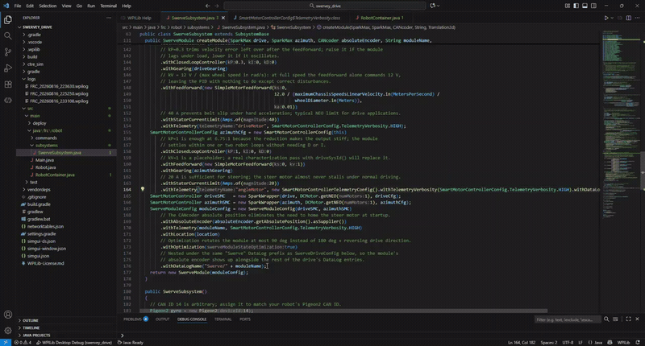
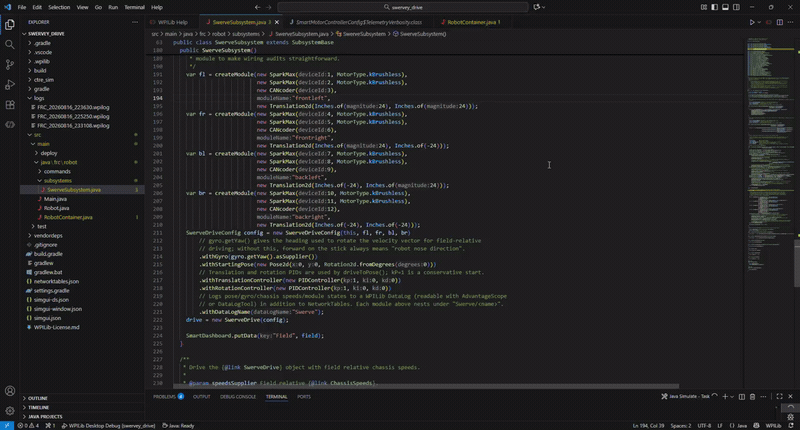
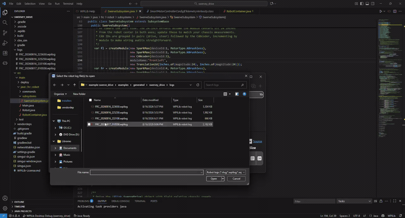
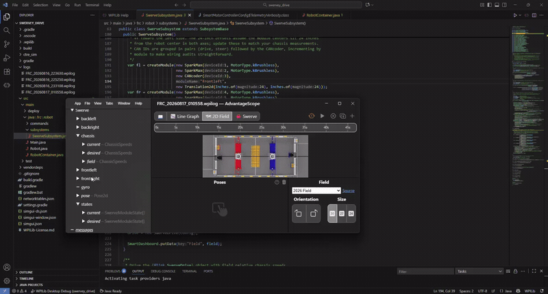

# How do I view my DataLog in AdvantageScope?


**This is not "Log Replay."** [AdvantageKit's Log Replay](https://docs.advantagekit.org/getting-started/what-is-advantagekit) re-runs your robot code against a recorded log to deterministically reproduce a match in simulation, it requires the AdvantageKit IO-interface pattern described in [AdvantageKit Integration](../details/advantagekit-integration.md). What this page covers is simpler and works with **every** YAMS project, AdvantageKit or not: opening the `.wpilog` file your robot already wrote and looking at the recorded values in AdvantageScope. Nothing re-executes, you're just viewing a file.


Every YAMS telemetry field can be routed to a WPILib `DataLog` in addition to (or instead of) NetworkTables, see [Telemetry](../understanding/telemetry.md) and [DataLog Best Practices](../details/datalog-best-practices.md) for the full API. This page is the practical walkthrough, recorded end-to-end on the [Swerve Drive tutorial](../tutorials/swerve-drive.md)'s example subsystem: configuring it to log, running it, and opening the resulting file in [AdvantageScope](https://docs.advantagekit.org/tools/advantagescope/).

## Step 1: Make sure a DataLog is actually being written

`DataLogManager` owns the actual file on disk; YAMS just writes into it. Start it once, early, in `Robot.java`:

```java
@Override
public void robotInit() {
  DataLogManager.start();
  DriverStation.startDataLog(DataLogManager.getLog()); // optional: also logs joystick/DS data
}
```


If you never call `DataLogManager.start()` yourself, YAMS still starts it lazily the first time a field with a DataLog name is published, but calling it explicitly in `robotInit()` guarantees the log begins at power-on (not at the first telemetry update) and lets you fold in DS/joystick data with `DriverStation.startDataLog(...)`.


On the real robot, `.wpilog` files are written to a USB drive if one is plugged in, otherwise to `/home/lvuser/logs` on the roboRIO's internal storage. In simulation, they land in your project's `logs/` folder next to `build.gradle`. WPILib initially names the file `FRC_TBD_<random>.wpilog` and renames it to a timestamp (e.g. `FRC_20260817_010558.wpilog`) once it has a real time source, you'll see a `DataLog: Renamed log file from '...' to '...'` line in the console when that happens.

## Step 2: Configure the SwerveDrive to log

This walkthrough builds on the `SwerveSubsystem` from the [Swerve Drive tutorial](../tutorials/swerve-drive.md), with `withDataLogName(...)` added at three levels: the drive, each module, and (for field-level control) the azimuth motor inside each module.

<figure><figcaption><p>Walking through <code>SwerveSubsystem</code>'s <code>createModule()</code> and constructor, showing where each <code>withDataLogName(...)</code> call goes.</p></figcaption></figure>

`createModule()` builds one module's drive/azimuth motors and the `SwerveModuleConfig`:

```java
public SwerveModule createModule(SparkMax drive, SparkMax azimuth, CANcoder absoluteEncoder, String moduleName,
                                  Translation2d location)
{
  MechanismGearing driveGearing   = new MechanismGearing(12.75);
  MechanismGearing azimuthGearing = new MechanismGearing(6.75);
  Distance wheelDiameter = Inches.of(4);

  SmartMotorControllerConfig driveCfg = new SmartMotorControllerConfig(this)
      .withWheelDiameter(wheelDiameter)
      .withClosedLoopController(0.3, 0, 0)
      .withGearing(driveGearing)
      .withFeedforward(new SimpleMotorFeedforward(0,
          12.0 / (maximumChassisSpeedsLinearVelocity.in(MetersPerSecond) / wheelDiameter.in(Meters)), 0.01))
      .withStatorCurrentLimit(Amps.of(40))
      .withTelemetry("driveMotor", SmartMotorControllerConfig.TelemetryVerbosity.HIGH);

  SmartMotorControllerConfig azimuthCfg = new SmartMotorControllerConfig(this)
      .withClosedLoopController(1, 0, 0)
      .withFeedforward(new SimpleMotorFeedforward(0, 1))
      .withGearing(azimuthGearing)
      .withStatorCurrentLimit(Amps.of(20))
      // Granular per-field config (Step 2b below), chosen fields + its own DataLog name,
      // instead of the name+verbosity shorthand used for the drive motor above.
      .withTelemetry("angleMotor", new SmartMotorControllerTelemetryConfig()
          .withTelemetryVerbosity(SmartMotorControllerConfig.TelemetryVerbosity.HIGH)
          .withDataLogName(moduleName));

  SmartMotorController driveSMC   = new SparkWrapper(drive, DCMotor.getNEO(1), driveCfg);
  SmartMotorController azimuthSMC = new SparkWrapper(azimuth, DCMotor.getNEO(1), azimuthCfg);

  SwerveModuleConfig moduleConfig = new SwerveModuleConfig(driveSMC, azimuthSMC)
      .withAbsoluteEncoder(absoluteEncoder.getAbsolutePosition().asSupplier())
      .withTelemetry(moduleName, SmartMotorControllerConfig.TelemetryVerbosity.HIGH)
      .withLocation(location)
      .withOptimization(true)
      // Nested under the same "Swerve" DataLog prefix as SwerveDriveConfig below, so the module's
      // absolute encoder shows up alongside the rest of the drive's DataLog entries.
      .withDataLogName("Swerve/" + moduleName);
  return new SwerveModule(moduleConfig);
}
```

Then the constructor wires the drive-level DataLog name:

```java
SwerveDriveConfig config = new SwerveDriveConfig(this, fl, fr, bl, br)
    .withGyro(gyro.getYaw().asSupplier())
    .withStartingPose(new Pose2d(0, 0, Rotation2d.fromDegrees(0)))
    .withTranslationController(new PIDController(1, 0, 0))
    .withRotationController(new PIDController(1, 0, 0))
    // Logs pose/gyro/chassis speeds/module states to a WPILib DataLog (readable with AdvantageScope
    // or DataLogTool) in addition to NetworkTables. Each module above nests under "Swerve/<name>".
    .withDataLogName("Swerve");
drive = new SwerveDrive(config);
```


`SwerveDriveConfig.withDataLogName(...)` and `SwerveModuleConfig.withDataLogName(...)` are independent calls, setting one does not cascade to the other, and neither cascades to the drive/azimuth motors. That's why `createModule()` above sets a third, separate DataLog name directly on the azimuth motor's own `SmartMotorControllerTelemetryConfig`.


### C++

The same shape applies with `WithDataLogName`, based on the [C++ swerve example](https://github.com/Yet-Another-Software-Suite/YAMS/blob/master/examples/cpptest/src/main/cpp/subsystems/SwerveSubsystem.cpp):

```cpp
m_driveConfig.WithSubsystem(this)
    .WithModules({&m_fl.value(), &m_fr.value(), &m_bl.value(), &m_br.value()})
    .WithGyro([gyroPtr = &m_gyro]() -> units::degree_t {
      return units::degree_t{units::turn_t{gyroPtr->GetYaw().GetValue()}};
    })
    .WithTelemetry(SwerveDriveConfig::TelemetryVerbosity::HIGH)
    .WithDataLogName("Swerve");

moduleCfgMember
    .WithAbsoluteEncoder(/* ... */)
    .WithTelemetry(moduleName, Cfg::TelemetryVerbosity::HIGH)
    .WithLocation(location)
    .WithOptimization(true)
    .WithDataLogName("Swerve/" + moduleName);
```

See the C++ API reference's `SwerveDriveConfig` and `SwerveModuleConfig` pages for the full builder reference.

## Step 2b: Granular control, which fields, and where they go

The drive and azimuth motors underneath each module are ordinary `SmartMotorController`s, so, as shown on `azimuthCfg` above, you get the same field-level control you'd get on any standalone mechanism's motor by building a `SmartMotorControllerTelemetryConfig` and handing it to `withTelemetry(name, ...)` instead of the `withTelemetry(name, verbosity)` shorthand.

This is the _only_ granular knob in the whole swerve stack: `SwerveDriveConfig`/`SwerveModuleConfig` only expose a verbosity preset for the drive-level and per-module fields (pose, gyro, chassis speeds, module states, absolute encoder), there's no field-by-field opt-in and no way to disable NetworkTables for those. `SmartMotorControllerTelemetryConfig` controls both axes independently:

* **Which fields**, every field is disabled by default. `withTelemetryVerbosity(LOW/MID/HIGH)` turns on a cumulative preset; individual `with*()` methods (`withStatorCurrent()`, `withTemperature()`, `withMechanismPosition()`, ...) add or supplement it. See the full field list on the `SmartMotorControllerTelemetryConfig` API reference page.
* **Where they go**, `withDataLogName(name)` turns on DataLog for every enabled field under that prefix. `withoutNetworkTables()` (or `withNetworkTables(false)`) stops those same fields from reaching NT4. The two are independent: log-only, NT-only, both, or neither are all valid combinations.

A common competition pattern is to keep NT4 for practice/pit testing and drop it once you're on the field, while DataLog keeps recording either way:

```java
.withTelemetry("angleMotor", new SmartMotorControllerTelemetryConfig()
    .withTelemetryVerbosity(SmartMotorControllerConfig.TelemetryVerbosity.HIGH)
    .withDataLogName(moduleName)
    .withNetworkTables(!DriverStation.isFMSAttached()));
```


Want the deeper rationale for choosing LOW vs. MID vs. HIGH, and why to prune before a competition rather than after? See [DataLog Best Practices](../details/datalog-best-practices.md).


## Step 3: Run it and record

Deploy or simulate the robot, enable it, and drive around for a bit, every enabled loop writes to both NetworkTables and the DataLog for every field configured above.

<figure><figcaption><p>Running the swerve example in WPILib simulation and driving it around in Teleoperated to generate telemetry.</p></figcaption></figure>

## Step 4: Pull the file and open it in AdvantageScope

1. Grab the `.wpilog` off the RIO (USB drive, or `scp lvuser@10.TE.AM.2:/home/lvuser/logs/*.wpilog .`), or straight from your sim project's `logs/` folder.
2. Open **AdvantageScope**, then **File → Open File...** (or drag the `.wpilog` onto the window). Do **not** use "Connect to Robot/Simulator", that connects live over NetworkTables, which shows _current_ values, not the recorded run.

<figure><figcaption><p>Opening the recorded <code>.wpilog</code> via AdvantageScope's file picker, note the other logs from earlier runs sitting alongside it in the same <code>logs/</code> folder.</p></figcaption></figure>

3. AdvantageScope reads every logged entry into a field tree in the sidebar, grouped by the DataLog name prefixes you set in Steps 2–2b, with the `"Swerve"` prefix from this example, that's a single `Swerve` group containing `chassis/current`, `chassis/desired`, `pose`, `gyro`, and a `frontleft`/`frontright`/`backleft`/`backright` entry per module (plus that module's `angleMotor` DataLog entries from Step 2b).

## Step 5: Explore the data

Add a tab to visualize the data:

* **Swerve** tab, AdvantageScope's built-in module visualizer. Drag a `SwerveModuleState[]` field (e.g. `Swerve/states/current`) into the **Sources** list at the bottom to see wheel vectors animate over the timeline.
* **2D Field** tab, drag `Swerve/pose` in to see the robot's recorded path.
* **Line Graph** tab, drag any numeric field (gyro angle, a motor's stator current, mechanism position) to plot it over time, and use **right-click → Convert Units...** to change the displayed unit without touching robot code (see [Telemetry](../understanding/telemetry.md#using-advantagescope-for-unit-conversion)).

<figure><figcaption><p>Expanding the field tree and dragging <code>Swerve/states/current</code> into the <strong>Swerve</strong> tab's Sources to visualize the recorded module states, the wheel angles/speeds shown here match exactly what the modules reported during the run.</p></figcaption></figure>

Scrub the timeline at the top of the window to step through the run, or hit play to watch it back at normal speed.


Because this is just a file, you can open the same `.wpilog` in as many tabs/windows as you want, compare two different matches side by side, or hand the file to a teammate to look at independently, none of that requires the robot, the simulator, or AdvantageKit replay to be running.


## Related pages

* [Telemetry](../understanding/telemetry.md)
* [DataLog Best Practices](../details/datalog-best-practices.md)
* [Swerve Drive](../tutorials/swerve-drive.md)
* [AdvantageKit Integration](../details/advantagekit-integration.md), for the separate, unrelated concept of deterministic Log Replay
